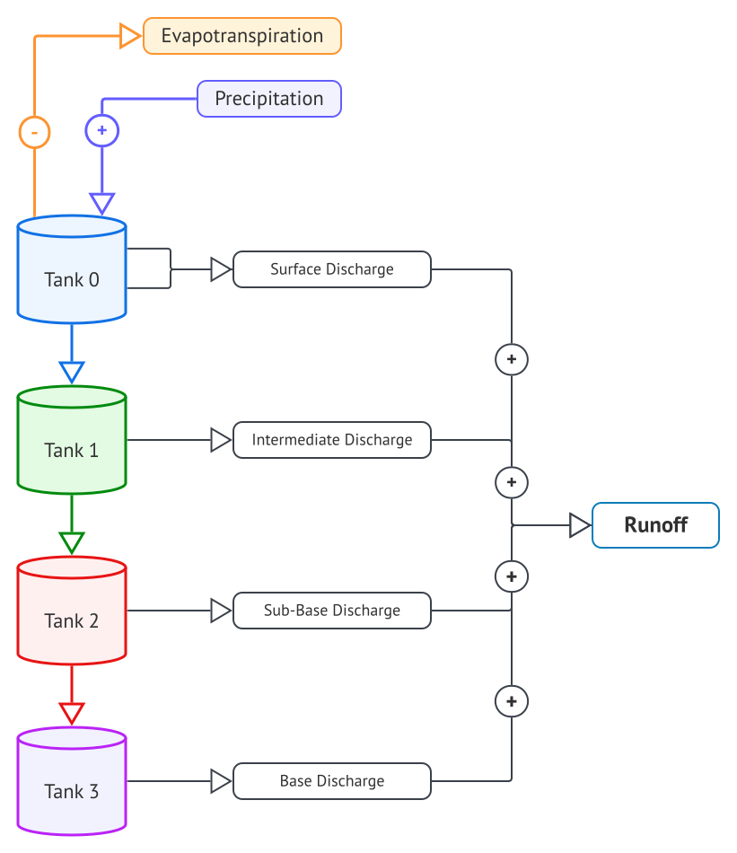

# Tank Hydrologic Model  
Python implementation of Tank Hydrologic Model, a conceptual rainfall-runoff model proposed by Sugawara and Funiyuki (1956)


<p align="center">

</p>

### Installation

Tank-Model can be installed as a python package using the following commands

```bash
$ git clone https://github.com/nzahasan/tank-model.git
$ cd tank-model
$ python3 setup.py install
```


### Model Setup Guide:

New project can be created using the following command. This creates a folder with a project defination inside it.
```bash
$ tank_cmd.py new_project project_name
```


### References:  
    1. Paik K., Kim J. H., Kim H. S., Lee D. R. (2005) A conceptual rainfall-runoff model considering seasonal variation.
    3. Aguilar C., Polo M. J. (2011) Generating reference evapotranspiration surfaces from the Hargreaves equation at watershed scale.