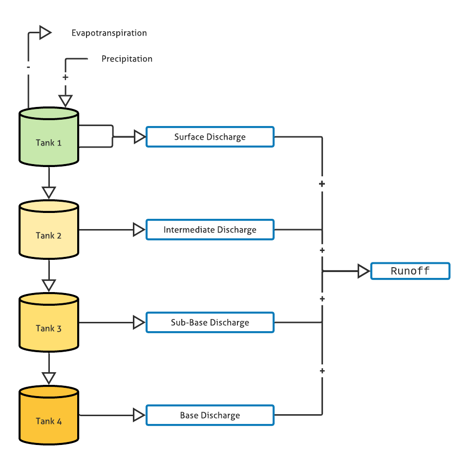

## <p style="font-family:monospace"> Tank Hydrologic Model </p>

<p style="font-family:monospace">
Python implementation of Tank Hydrologic Model, a conceptual rainfall-runoff model proposed by Sugawara and Funiyuki (1956)
</p>

<p align="center">

</p>

```
References:
1. Paik K., Kim J. H., Kim H. S., Lee D. R. (2005) A conceptual rainfall-runoff model considering seasonalvariation
3. Aguilar C., Polo M. J. (2011) Generating reference evapotranspiration surfaces from the Hargreaves equation at watershed scale
```